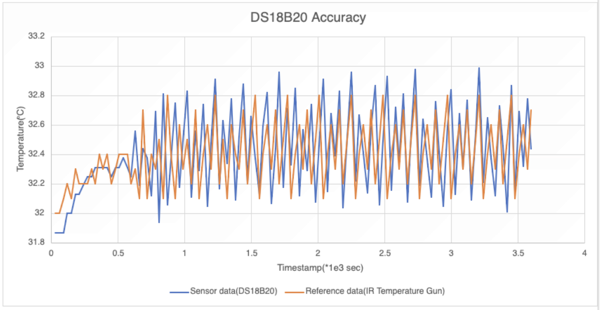
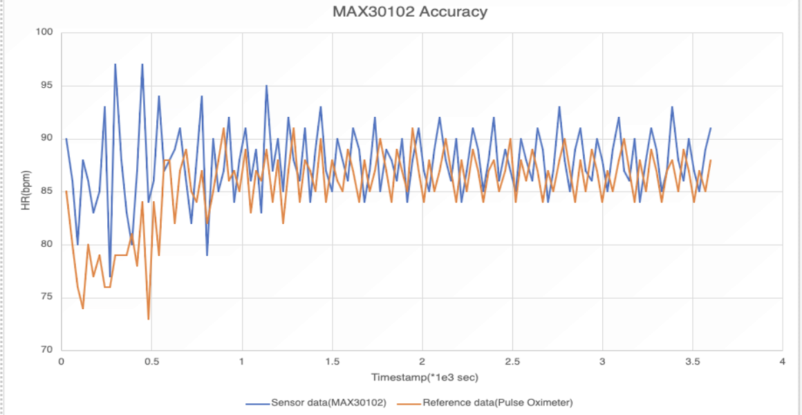

# Sensor Accuracy Validation

## Testing Methodology
- **Duration**: 1 hour continuous monitoring
- **Sampling Rate**: Every 30 seconds (120 total readings)
- **Validation**: Compared against reference devices

## Results

### DS18B20 Temperature Sensor
**Reference Device**: IR Temperature Gun

- **Mean Absolute Error (MAE)**: 0.229°C
- **Mean Absolute Percentage Error (MAPE)**: 0.706894%

**Analysis**: Excellent accuracy with minimal drift. Sensor readings closely track reference measurements throughout the test period.

### MAX30102 Heart Rate Sensor
**Reference Device**: Commercial Pulse Oximeter

- **Mean Absolute Error (MAE)**: 3.883333 BPM
- **Mean Absolute Percentage Error (MAPE)**: 4.64073%

**Analysis**: Good accuracy within acceptable ranges for physiological monitoring. Initial settling period observed, then stable performance.

### GSR Sensor
**Status**: Validation pending due to lack of standardized reference devices.

**Challenge**: GSR sensors require specialized reference equipment not readily available. Alternative validation approaches using repeatability studies and physiological correlation are planned.

## Summary

| Sensor | MAE | MAPE | Status |
|--------|-----|------|--------|
| DS18B20 | 0.229°C | 0.71% | ✓ Validated |
| MAX30102 | 3.88 BPM | 4.64% | ✓ Validated |
| GSR | - | - | Pending |

Both validated sensors demonstrate acceptable accuracy for physiological monitoring applications. The temperature sensor shows exceptional precision, while the heart rate sensor provides reliable measurements within clinical standards.

## Data Files
- [`sensors_accuracy.csv`](/sensors_accuracy_1hr.csv) - Raw validation data for all tested sensors