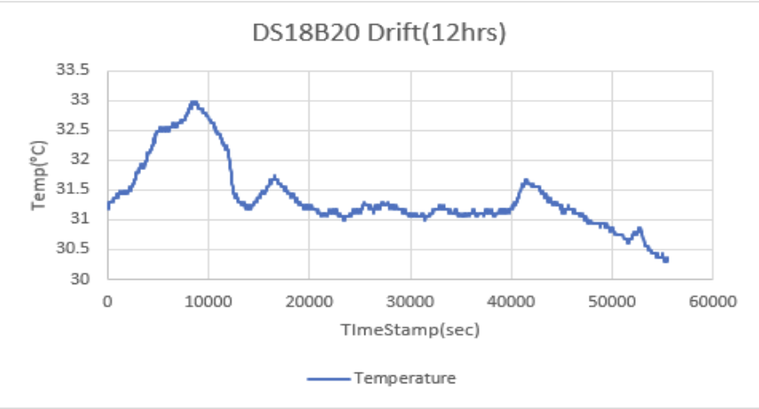
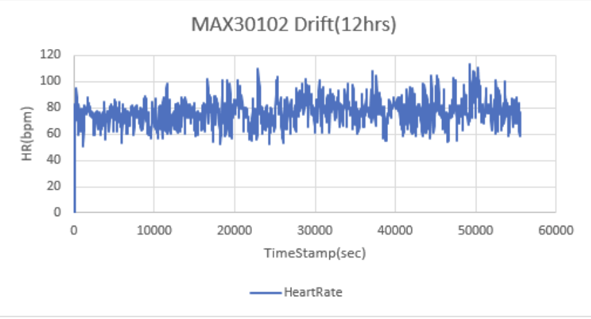
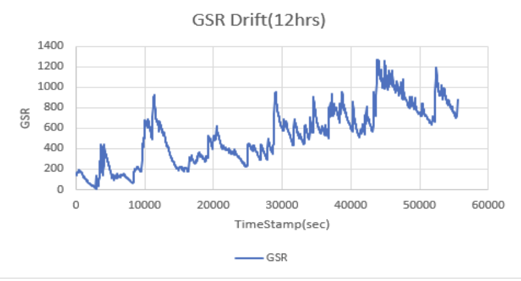

# Sensor Drift Analysis

## Testing Methodology
- **Duration**: 15 hours continuous monitoring
- **Sampling Rate**: Every 30 seconds
- **Total Readings**: 1,800 per sensor
- **Test Period**: Overnight monitoring (started before sleep)

## Purpose
Long-term stability assessment to evaluate sensor performance over extended periods and identify any systematic drift that could affect mood detection accuracy.

## Results

### DS18B20 Temperature Sensor

**Analysis**: Temperature sensor shows excellent long-term stability with minimal drift over the 15-hour period. Variations primarily correlate with ambient temperature changes.

### MAX30102 Heart Rate Sensor

**Analysis**: Heart rate sensor maintains consistent baseline with natural variations corresponding to sleep-wake cycles. No systematic drift observed.

### GSR Sensor

**Analysis**: GSR sensor demonstrates stable baseline with expected variations due to physiological changes during sleep. Drift characteristics within acceptable limits.

## Summary
All sensors demonstrate acceptable long-term stability for continuous physiological monitoring. No significant systematic drift was observed that would compromise the mood detection system's reliability.

## Data Files
- [`sensors_drift_15hrs.csv`](sensors_drift_15hrs.csv) - Raw 15-hour drift monitoring data
